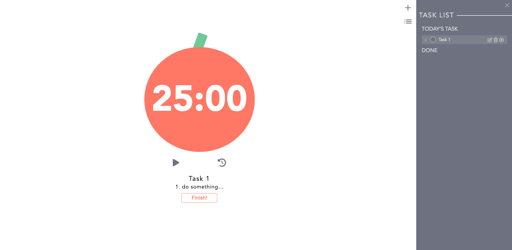
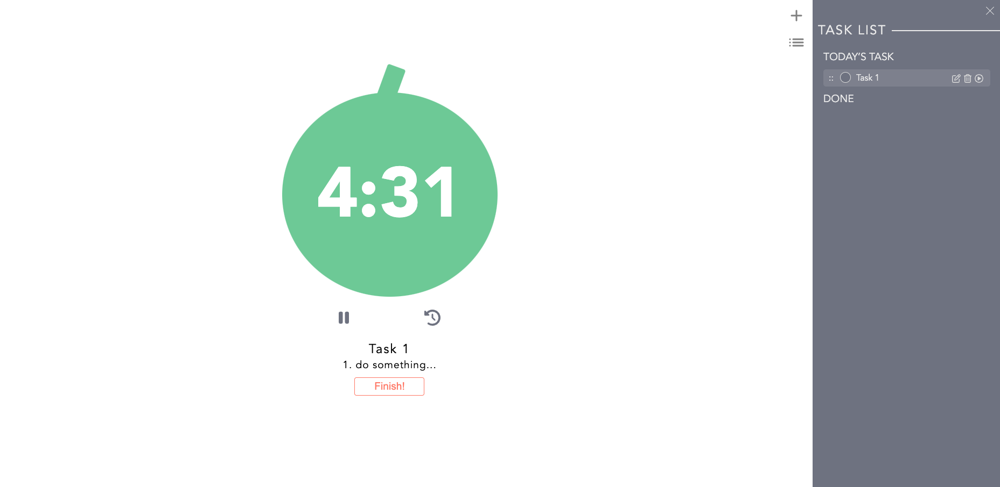

# pomodoro
使用 Vue.js 打造的番茄鐘。<br />
可以[點我](https://haru5386.github.io/sideproject-pomodoro/#/)立即使用使用看吧！

## 產品功能如下：
 * 使用者先規劃任務，點擊右邊導覽列中的 '+'，新增預計完成的清單事項。
 * 使用者點選清單中的 '▶' 按鈕，將目前要完成的任務加入至主頁面，系統自動設定 25 分鐘的工作時間。
 * 25 分鐘後，鬧鈴會響起，並有 5 分鐘的休息時間。
 * 工作完成時，可以隨時點擊 'finish' 加至完成清單。

## 產品畫面預覽



## 下載方法：
 1. 打開終端機，Clone 此專案至本機電腦
 
```
git clone https://github.com/haru5386/todo-sequelize
```

2. 進入存放此專案的資料夾

```
cd todo-sequelize
```

3. 安裝 npm 套件，

```
npm install
```

4. 運行伺服器，

```
npm run serve
```

5. 打包檔案

```
npm run build
```

6. 顯示`  App running at:  - Local:   http://localhost:8080/`
   表示成功進入

